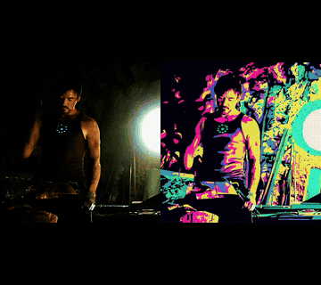
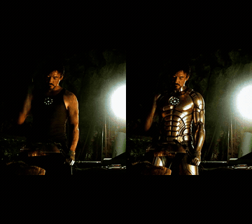
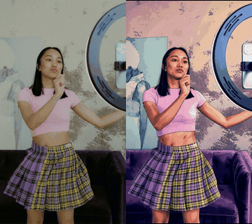
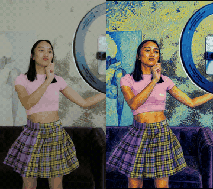
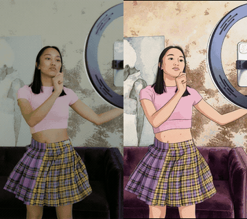

# ComfyUI-H3-LongTake

Long videos with **MiniMax H3** (Ref2VA), rendered clip by clip with continuity between clips,
on consumer GPUs: VRAM and RAM only ever hold **one clip**. Two use cases, one node:

- **Motion / identity transfer** — a reference video drives the performance, one or more pictures define who
  is in it (Ref2VA).
- **Style transfer and retexture** — the source video is re-rendered in a new style (Ghibli, Van Gogh, GTA,
  pop-art, The Simpsons…) or an outfit's material/colour is changed, keeping motion, framing and scene, with
  NRDX's *StyleTransfer* LoRA.

Every clip is written to disk as soon as it is done: you can stop, resume, redo a single clip, and assemble the
final video with the original audio. The full workflow is stored inside the project folder and inside the
final mp4, so any output can be dropped back onto ComfyUI to reopen the graph.

Depends on **ComfyUI core ≥ 0.34** only (no other node packs). Tested on a 16 GB GPU (RTX 4080-class) with
25 GB of Qwen text-encoder weights staged in system RAM.

## Examples

Source on the left, result on the right (8 s excerpts, 10 fps GIFs; full clips with audio in
[`examples/video/`](examples/video/)). All rendered with `source_role = guide`, 4 Turbo steps,
`context_frames = 5`, `seam_match = color`, on a 16 GB GPU.

| Pop-art from a swatch | Outfit retexture (text only) | GTA from a swatch |
|---|---|---|
|  |  |  |
| `style_transfer: … the style of <Picture 1>: bold graphic style, vibrant flat colours, clean black outlines, flat shading, halftone dots.` with [this swatch](examples/style_popart_halftone.png) | `retexture: change the tank top to shiny gold metallic armour plating, keeping face, hair, arc reactor, background, lighting and motion unchanged.` | `style_transfer: … the style of <Picture 1>: cel-shaded illustration, thick clean outlines, flat saturated pastel palette… Keep the original indoor room…` with [this swatch](examples/style_gta_swatch.png) |

| Van Gogh (text only) | Studio Ghibli (text only) | The Simpsons (text only) |
|---|---|---|
|  |  |  |
| `… in the style of Vincent van Gogh: thick swirling impasto brushstrokes, visible paint texture…` | `… in the style of a Studio Ghibli anime film: hand-drawn 2D animation look, soft clean linework…` | `… in the style of The Simpsons cartoon: flat 2D cel animation, thick clean black outlines, yellow skin…` |

Full prompts in the [use-case table](#use-cases-all-tested-prompts-verbatim) below. The dancer and press-conference
clips are free [Pexels](https://www.pexels.com/) videos (no audio track on the dancer clip); the cave clip is a film excerpt.

---

## Installation

```bash
cd ComfyUI/custom_nodes
git clone https://github.com/mark9009/ComfyUI-H3-LongTake
```

Restart ComfyUI. `ffmpeg` must be reachable: the node uses VideoHelperSuite's ffmpeg if that pack is installed,
otherwise the `imageio-ffmpeg` binary (`pip install imageio-ffmpeg` into ComfyUI's Python), otherwise `ffmpeg` on
the PATH. No other Python dependency.

### Models

| slot | file (ComfyUI folder) | notes |
|---|---|---|
| diffusion model | `minimax_h3_ref2va_pruned_fp8_scaled.safetensors` (`models/diffusion_models`) | from the official Comfy-Org MiniMax-H3 release |
| text encoder | a MiniMax H3 Qwen3-VL-32B build (`models/text_encoders`), loaded with `CLIPLoader`, type `minimax` | int8 / nvfp4 builds both work; ~25 GB, kept in system RAM |
| video VAE | `minimax_h3_video_vae_fp16.safetensors` (`models/vae`) | |
| audio VAE | `minimax_h3_audio_vae_fp32.safetensors` (`models/vae`) | |
| Turbo LoRA | `minimax_h3_ref2v_turbo_4step_v0.1_comfyui_bf16.safetensors` (`models/loras`) | 4 steps, the node samples positive-only (CFG 1) |
| StyleTransfer LoRA (optional) | `minimax_h3_style_transfer_v1.0_r64.safetensors` (`models/loras`) | [NRDX on Civitai](https://civitai.com/models/2932297) — needed only for `source_role = guide` |

The example workflows reference these file names; pick your own text-encoder file in the `CLIPLoader`.

---

## Quick start

1. Load `workflow/H3_LongTake_example.json` (motion + identity) or `workflow/H3_LongTake_style.json`
   (style transfer / retexture).
2. Put your source video in `ComfyUI/input/` and select it in `source_file`; connect your picture(s) to
   `ref_image_1..3`.
3. Set `dry_run = true` and queue: the node prints the slicing plan (how many clips, how long).
4. Set `dry_run = false`, `max_clips = 2`, queue: check identity/style and the seam in the node's preview.
5. Set `max_clips = 0`, `mode = continue`, queue: the whole video. If ComfyUI stops, queue again — it resumes
   from the first missing clip.
6. A clip came out wrong? `mode = redo_one`, `redo_from_clip = N`, change the seed. Want to change direction
   from clip N on? `mode = redo_from`.
7. Unmute **H3 LongTake Stitch** (Ctrl+M): it concatenates the chunks without re-encoding and puts the original
   audio back. Output: `ComfyUI/output/<output_name>.mp4`.

Timing on a 16 GB GPU at 544×960, 124-frame clips, Turbo 4 steps: **~4:40 per clip** (VAE encode 26 s, Qwen
58 s, sampling 2:35, decode 40 s). A 60 s video ≈ 12 clips ≈ 1 hour.

---

## How it works

```
L = clip_frames (17k+5)          C = context_frames

clip 0 : source [0, L)                                   → all of it goes out
clip i : source [i·(L−C), i·(L−C)+L)  anchor = tail of i−1 → first C frames trimmed
```

For every clip, the matching slice of the source (24 fps, decoded by ffmpeg just for that clip) becomes
`<Video 1>` — or a **guide latent** in style mode — and the pictures become `<Picture 1..3>`. The last C latent
frames (video + audio) of the previous clip are anchored at frame 0 as a native H3 keyframe. The node samples,
decodes, trims the C overlapping frames, and writes `clip_NNN.mp4` + `clip_NNN.latent.pt` to
`output/h3_longtake/<project_name>/`. The last clip is padded to the next 17k+5 length by freezing the last
source frame, then trimmed: the output has exactly the source's duration.

Between clips the node evicts the models from VRAM (they stay staged in RAM and reload in a second): with the
DiT resident, the 25 GB Qwen encoder goes from 1 minute to 10 minutes per clip.

---

## Use cases (all tested, prompts verbatim)

Settings unless noted: `source_role = guide`, `context_frames = 5`, `anchor_mode = keyframe`,
`seam_match = color`, Turbo 4 steps, StyleTransfer LoRA 1.0, 0.5–0.7 MP.

| case | `<Picture 1>` | prompt | result |
|---|---|---|---|
| **Motion + identity** (Ref2VA, `source_role = reference`) | photo of the person, same framing as the video | see `workflow/H3_LongTake_example.json` | the person of the picture performs the video; seam 0.96, motion correlation 0.57 |
| **Pop-art from an image** | synthetic halftone swatch, no figures | `style_transfer: Re-render this video with the style of <Picture 1>: bold graphic style, vibrant flat colours, clean black outlines, flat shading, halftone dots.` | style applied, room and people of the video kept; seam ΔE 0.9 |
| **Outfit retexture** (`guide_retexture`) | none | `retexture: change the dress to red glossy latex, keeping face, hair, background and motion unchanged.` | only the garment changes, consistent across clips; ΔE 3.4. Name the exact garment ("the dress", not "the outfit") |
| **GTA from text** | none | `style_transfer: Re-render this video in the style of GTA V cover artwork: cel-shaded comic illustration, thick dark outlines, flat saturated colours, hard-edged shadows, glossy highlights. Keep the original indoor room, furniture and background exactly as in the video; do not add any new scenery.` | works; without the last sentence the model may invent a city skyline; "loading screen" in the prompt adds HUD boxes |
| **GTA from a full artwork** (skyline, water, characters) | the whole poster, prompt without attributes | — | **fails**: the room becomes a skyline in clips 0–1 and a room again in clip 2 |
| **GTA from a swatch** | crop of the artwork with no scenery (a shirt/torso) | `style_transfer: Re-render this video with the style of <Picture 1>: cel-shaded illustration, thick clean outlines, flat saturated pastel palette, hard-edged shadows, glossy highlights. Keep the original indoor room, wooden ceiling, furniture and background exactly as in the video; do not add any scenery, buildings or water from <Picture 1>.` | room kept for 15 s over 3 clips, ΔE 0.8 / 0.2 |
| **Van Gogh from text** | none | `style_transfer: Re-render this video in the style of Vincent van Gogh: thick swirling impasto brushstrokes, visible paint texture, bold complementary colours with deep blues and warm yellows, expressive dark outlines. Keep the original indoor room, wooden ceiling, furniture, people and framing exactly as in the video; do not add any new scenery.` | impasto strokes, Starry-Night swirls on flat surfaces; room, people and motion kept; ΔE 2.1 / 0.8 |
| **Studio Ghibli from text** | none | `style_transfer: Re-render this video in the style of a Studio Ghibli anime film: hand-drawn 2D animation look, soft clean linework, flat cel shading with gentle gradients, warm pastel palette, painterly watercolour backgrounds. Keep the original indoor room, wooden ceiling, furniture, people and framing exactly as in the video; do not add any new scenery.` | clean 2D anime look, faces redrawn yet recognisable, watercolour background; ΔE 0.6 / 0.6 |
| **The Simpsons from text** (press conference at a podium, 19.8 s, 4 clips, 16:9) | none | `style_transfer: Re-render this video in the style of The Simpsons cartoon: flat 2D cel animation, thick clean black outlines, flat bright colours, yellow skin, simplified cartoon faces with large round white eyes, no shading. Keep the original setting, podium, flags, wall, framing and motion exactly as in the video; do not add any new scenery or characters.` | yellow skin and caricature face, flags/podium/gestures kept; ΔE 1.2 / 0.9 / 0.3 |
| **The Simpsons from the family artwork** | the whole poster (house + 5 characters) | same as above with `<Picture 1>` and "do not add any scenery, house or characters from <Picture 1>" | with the constraint the scene is kept; the picture pushes the palette (flatter, more saturated) and caricatures the face less |

### Prompting rules that came out of the tests

- **Named styles work from text alone** (Ghibli, Van Gogh, GTA, The Simpsons): list 3–5 visual attributes and
  say what to keep. Use an image when the style has no name, or to impose a specific palette.
- **Never mix a style name and `<Picture 1>` in the same sentence** — the model follows the text and ignores
  the image (LoRA author's note, confirmed).
- **With `<Picture 1>`, always list the attributes to copy and say what to keep of the video.** Without
  that, the LoRA copies scenery from the picture (a poster with a skyline turns the room into a city).
- **Style images without faces or scenery**: crop a swatch (fabric, shading, palette) if needed. Pictures with
  prominent figures transfer identity.
- `retexture:` changes material/colour of one item while keeping motion — no masks needed. Name the exact item.

---

## Node reference

### H3 LongTake Render

| input | notes |
|---|---|
| `model`, `clip`, `vae`, `audio_vae` | LoRAs already applied to `model` |
| `source_file` | video in `input/`; ffmpeg decodes only each clip's slice |
| `start_seconds` / `end_seconds` | range of the source to use (0 = all). Cut useless tails such as TikTok end cards; the Stitch takes the audio from the same point |
| `source_video` / `source_fps` / `source_audio` | alternative: IMAGE batch, only for short tests (float32 ≈ 6 MB/frame) |
| `ref_image_1..3` | `<Picture N>` |
| `prompt` / `prompt_text` | use `<Video 1>` and `<Picture N>` (Ref2VA) or the `style_transfer:` / `retexture:` templates (guide). `prompt_text` is a socket for an external text node and, when connected, replaces the field. Changing `source_role` fills the field with the role's template unless you already wrote your own |
| `source_role` | `reference` (default): the slice is `<Video 1>`, a motion suggestion. `guide`: the slice is a guide latent anchored at frame 0 for the whole clip — frame-accurate motion and framing, for the StyleTransfer LoRA with `<Picture 1>` = style. `guide_retexture`: like guide, text-only `retexture:` template. `guide+reference`: both (measured: no gain, +50 % time) |
| `aspect` / `megapixels` | output canvas: `source` = the source's aspect ratio (default). A canvas with a different aspect makes H3 copy `<Video 1>` and ignore `<Picture 1>`. `width`/`height` only count with `manual` |
| `clip_frames` | 124 = 5.2 s (default), 243 = 10.1 s. Longer clips ≈ proportionally longer sampling |
| `context_frames` | **5** (default): clean seam and reference adherence equal to no anchor. 22: longer anchor, measured worse for adherence. Every clip yields L−C new frames |
| `anchor_mode` | `keyframe` (default): latent tail as H3 guide on frames 0..C−1, then trimmed. `inpaint`: tail copied into the latent and protected by the denoise mask (fine with 5, a cut with 22; leaves a faint smear on the copied frames). `none`: independent clips. Changing it changes the plan → `restart` |
| `seam_match` | `off` (default) / `color` / `luminance`: corrects the first 24 frames of each clip towards the previous clip's last frames (exposure ±0.25 EV and, in `color`, a per-channel hue offset), cosine fade. Pixels only. Measured with guide + keyframe 5: seam ΔE 5.8 → 0.9. Recommended `color` for style transfer |
| `mode` | `continue`: skip clips already on disk · `restart`: delete everything · `redo_from`: redo from `redo_from_clip` on · `redo_one`: redo **only** `redo_from_clip`, head anchored to the previous clip and tail to the next (seams stay) |
| `max_clips` | render only the first N |
| `dry_run` | print the plan only |
| `use_source_audio` | source audio as `<Video 1>`'s soundtrack (lip-sync; costs tokens) |
| `ref_video_size` | `match` (default): `<Video 1>` scaled to the output area · `native`: the core node's 768 canvas |

Outputs: `last_clip`, `project_dir`, `report`. The node shows a preview of every chunk present (`preview.mp4`,
no audio) and the plan.

If you change canvas, `clip_frames`, context, source role or source, the node refuses to continue an existing
project: use `restart` or another `project_name`.

**Getting back to a project.** At the start of every run (before clip 0) the node writes into the project folder
`workflow.json` (the full graph — drop it onto ComfyUI), `api_prompt.json` and `settings.json` (readable summary:
prompt, source, images, LoRA chain, parameters); the `*_first.json` copies belong to the first run and are never
touched again. The preview and the Stitch output carry `workflow`/`prompt` tags inside the mp4 exactly like core
`SaveVideo`: dropping the final video onto ComfyUI reopens the graph.

### H3 LongTake Stitch

Concatenates the chunks without re-encoding, puts the original audio back and shows the result
(`output/<output_name>.mp4`). Connect the Render's `project_dir` to the `project_dir` socket: project and audio
(`audio_file = (auto from project)`, from the same `start_seconds`) come from there. Alternatively pick/upload a
video in `audio_file` or connect an `AUDIO`. Audio is cut to the video's length, never the other way round.
Existing files are never overwritten (`_001`, `_002`… suffixes).

---

## Measurements (124-frame clips × 2, seed 0, vertical TikTok source, 16 GB GPU)

Ref2VA (`source_role = reference`):

| anchor | seam (1 = no cut) | follows the motion (corr.) |
|---|---|---|
| none | 0.02 | 0.56 |
| keyframe, 22 | 0.96 | 0.38 |
| keyframe, 5 | 0.96 | 0.57 |
| inpaint, 5 | 0.97 | 0.56 |
| inpaint, 22 | 0.04 | 0.70 |
| keyframe at negative indices | 0.02 | 0.69 |

Ref2VA treats `<Video 1>` as a suggestion: framing drifts towards `<Picture 1>` after 1–2 s when the picture has
a different framing than the video. Use a picture with the same framing and say so in the prompt — or use
`source_role = guide` for rigid control.

Guide latent (`source_role = guide`, StyleTransfer LoRA):

| anchor | seam | follows the motion (corr. / frame similarity) | colour jump at the seam (ΔE) |
|---|---|---|---|
| none | 0.87 | 0.80 / 0.93 | 25 (palette changes) |
| inpaint, 5 | 0.99 | 0.78 / 0.93 | 10 (smear on copied frames) |
| keyframe, 5 | 0.96 | 0.78 / 0.93 | 6 → **0.9 with `seam_match = color`** |
| keyframe, 5 + `<Video 1>` | 0.98 | 0.75 / 0.92 | 10, +50 % time |
| inpaint, 5, 8 steps | 0.99 | 0.72 / 0.92 | 9, +50 % time |

With the guide, framing drift disappears (frame similarity 0.93 constant vs 0.57 for Ref2VA); the anchor is still
needed to keep the palette between clips. Every clip also saves `clip_NNN_ref.mp4`: the reference exactly as the
model saw it.

---

## Limits

- Ref2VA: `<Video 1>` is a motion guide, not frame-accurate control; use `guide` for that.
- The prompt defines who is who: a second person entering the source without a `<Picture 2>` gets invented.
  Ref2VA regenerates the whole scene, it does not replace a single person.
- Guide mode regenerates the whole scene as well: a scene change in the source is a scene change in the output.
- Positive-only sampling (CFG 1), designed for the Turbo LoRA.
- Long chains degrade slowly (each clip is generated from the previous one's output); the latent context avoids
  one VAE round trip per link. Restart the project at a natural cut for very long material.

---

## Developer tools

`tools/` contains the model-free test harness (`test_render_loop.py`: fake VAE/CLIP, monkey-patched sampler),
API drivers for test batteries (`run_tests.py`, `run_style_tests.py`, `rerun_history.py`) and measurement scripts
(`align_check.py`: motion lag/correlation and frame similarity vs the source; `junction.py`: seam continuity;
`color_check.py`: Lab colour jump at the seam). Set `COMFY_DIR` / `COMFY_PYTHON` for your install (see the
scripts' headers).

## Credits

- Motion-context idea: NikoDemon80 (Motion-Context) and the Banodoco MiniMax H3 seamless-extension thread;
  ethanfel (Context-Loop) for slicing the reference with overlap = context.
- Seam exposure match idea: nikaskeba (ComfyUI-Minimax-H3-Reference-Library), extended here to hue.
- StyleTransfer / retexture LoRA: NRDX.
- MiniMax H3 core support: ComfyUI team.

License: MIT.
